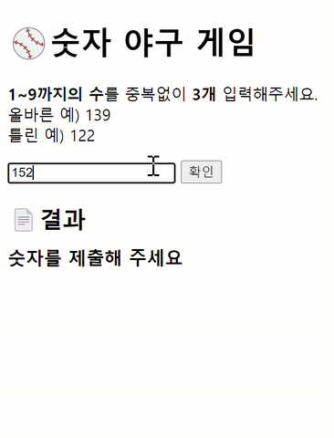

# ⚾ 숫자 야구 게임 
## javascript-baseball-precourse

<br/>

## 기능 요구사항
기본적으로 1부터 9까지 서로 다른 수로 이루어진 3자리의 수를 맞추는 게임이다.
- 같은 수가 같은 자리에 있으면 스트라이크, 다른자에 있으면 볼, 같은 수가 전혀 없으면 낫싱이란 힌트를 얻고,
그 힌트를 이용해서 먼저 상대방(컴퓨터)의 수를 맞추면 승리한다.

```
e.g.
상대방(컴퓨터)의 수가  425일 때,
- 123을 제시한 경우: 1스트라이크
- 456을 제시한 경우: 1볼 1스트라이크
- 789를 제시한 경우: 낫싱
```
- 위 숫자 야구 게임에서 상대방의 역할을 컴퓨터가 한다. 컴퓨터는 1에서 9까지 서로 다른 임의의 수 3개를 선택한다. 게임 플레이어는 컴퓨터가 생각하고 있는
  3개의 숫자를 입력하고, 컴퓨터는 입력한 숫자에 대한 결과를 출력한다.
- 이 같은 과정을 반복해 컴퓨터가 선택한 3개의 숫자를 모두 맞히면 게임이 종료되고 재시작 버튼이 표시된다.
- 게임을 종료한 후 게임을 다시 시작하거나 완전히 종료할 수 있다.
- 사용자가 잘못된 값을 입력할 경우 `alert()` 으로 에러 메시지를 출력 후 그 부분부터 입력을 다시 받는다.

<br/>

## ⚠️ 프로그래밍 요구사항 1
- Node.js 18.17.1 버전에서 실행 가능해야 한다. 
- `package.json` 파일은 변경할 수 없으며, __제공된 라이브러리와 스타일 라이브러리 이외의 외부 라이브러리는 사용하지 않는다.__ 
- 프로그램 종료 시 `process.exit()` 를 호출하지 않는다. 
- 프로그래밍 요구 사항에서 달리 명시하지 않는 한 파일, 패키지 등의 이름을 바꾸거나 이동하지 않는다.

<br/>

## ⚠️ 프로그래밍 요구사항 2
- 자바스크립트 코드 컨벤션을 지키면서 프로그래밍한다. 
  - 기본적으로 [Airbnb JavaScript Style Guide](https://github.com/airbnb/javascript)를 원칙으로 한다.
- indent(인덴트, 들여쓰기) depth를 3이 넘지 않도록 구현한다. 2까지만 허용한다.
  - 예를 들어 while문 안에 if문이 있으면 들여쓰기는 2이다.
  - 힌트: indent(인덴트, 들여쓰기) depth를 줄이는 좋은 방법은 함수(또는 메서드)를 분리하면 된다.
- 함수(또는 메서드)가 한 가지 일만 하도록 최대한 작게 만들어라.
- `import` 문을 사용하여 스크립트를 [모듈화](https://developer.mozilla.org/ko/docs/Web/JavaScript/Guide/Modules)하여 가져올 수 있도록 한다.

<br/>

## 🖐️ 기능 리스트
- [x] 사용자 인터페이스
  - 입력창 및 결과 표시 보드
- [x] 3자리수 타겟 생성
  - 1~9 사이의 중복 되지 않는 3자리 수
- [x] 유효한 사용자 입력 받기
  - 1~9 사이의 중복 되지 않는 3자리 수
- [x] 사용자 입력과 타겟 비교해서 점수 매기기
  - 각 원소를 비교해서 스트라이크, 볼 통합 점수 계산
- [x] 결과를 사용자에게 공지
  - 통합 점수를 사용해 comment 생성 후 결과 표시 보드에 출력
- [x] 게임 재시작 버튼
  - 사용자가 정답을 맞췄을 경우 생성
  - 클릭시 새로운 타겟 생성 및 사용자 입력을 받을 준비
- [x] 동적인 효과를 위한 애니메이션
  - 사용자 입력이 validation을 통과했다는 것을 암시
  - 애니메이션 종료후 comment를 결과 표시 보드에 출력
- [x] 완전 종료 버튼
  - 사용자가 정답을 맞췄을 경우 2초후 생성
  - 클릭시 완전 종료
- [x] 모듈화
  - main.js 모듈화

<br/>




