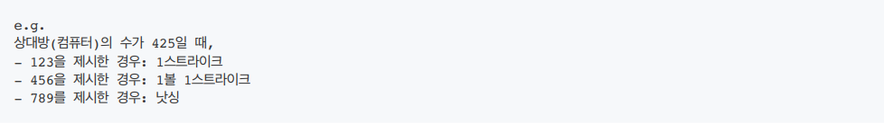
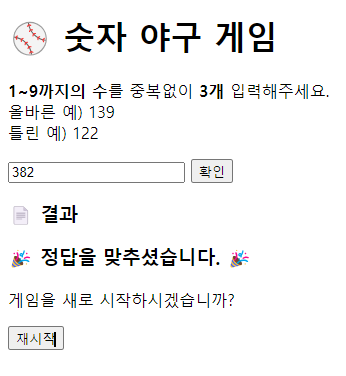

# javascript-baseball-precourse
구현할 기능
-----
1.  1부터 9까지 서로 다른 수로 이루어진 3자리의 수를 맞추는 게임을 만들어야함.
- 같은 수가 같은 자리에 있으면 `스트라이크`,  
다른 자리에 있으면 `볼`,  
같은 수가 전혀 없으면 `낫싱`이란 힌트를 얻고,  
그 힌트를 이용해서 먼저 상대방(컴퓨터)의 수를 맞추면 승리한다. 

- 위 숫자 야구 게임에서 상대방의 역할을 컴퓨터가 한다.  
컴퓨터는 1에서 9까지 서로 다른 임의의 수 3개를 선택한다.  
게임 플레이어는 컴퓨터가 생각하고 있는 3개의 숫자를 입력하고, 컴퓨터는 입력한 숫자에 대한 결과를 출력한다.
- 이 같은 과정을 반복해 컴퓨터가 선택한 3개의 숫자를 모두 맞히면 게임이 종료되고 재시작 버튼이 표시된다.
- 게임을 종료한 후 게임을 다시 시작하거나 완전히 종료할 수 있다.
- 사용자가 잘못된 값을 입력할 경우 alert() 으로 에러 메시지를 출력 후 그 부분부터 입력을 다시 받는다. 

살행 결과
-----
